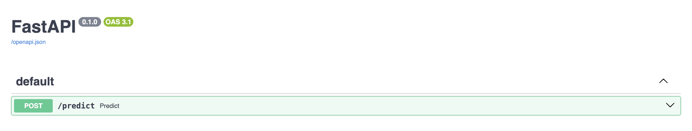

# README
Description 
We developed machine learning models that would predict whether a review given by a user is positive (1) or negative (0). We created 4 simple models (Naïve Bayes, SVM, KNN and Logistic Regression), trained and evaluated them. The project includes an API and a Docker file, and can be ran directly through a command-line interface. 

Installation 
1. Clone the repository using the following link : https://github.com/pmiranda-jean/mlopsproject.git 

2. OPTIONAL, only if the models are not saved within the 'models' folder. 
    In your terminal, modify the values and paste it in your terminal: 
    python cli_run.py --mode train --model svm --train_path source/data/Train.csv --test_path source/data/Test.csv 

    --mode : whether you want to train or evaluate. You have to train before evaluate. 
    --model : which model you want to use. Options are naive, knn, svm and logistic. 
    --train_path: the path of your train dataset
    --test_path: the path of your test dataset

3. Set up the environment with Docker 
    1. Build the Docker image by posting the following text in your terminal: 
    text: docker build -t my-fastapi-app .
    2. Run the Docker contained by posting the following text in your terminal: 
    text: docker run -p 8000:8000 my-fastapi-app

4. Test the model in a web browser
    3. Run the application using by posting the following link in an url: 
    link: http://127.0.0.1:8000/docs
    4. Your browser should open this webpage. Click on 'POST'. Then click on 'Try it out'. 
    
    5. Modify the text between "" for text and model name. 
    An example: 
    { "text": "This movie was really bad",
      "model_name": "svm"
     }
    6. Click on "Execute". You should see whether your comment was negative (prediction = 0) or positive (prediction = 1)
